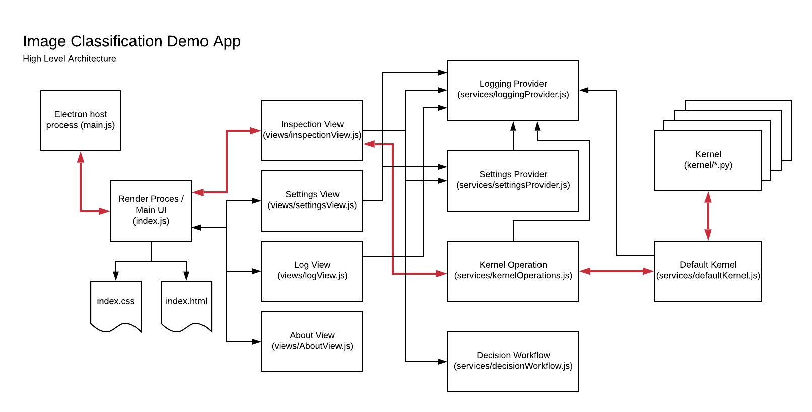

### Architecture

The architecutre of the demo app is fairly straightforward, following the typical pattern for Electron-style apps. 

Mapping the functional areas to source files gives the following:

* Startup (`main.js`)
    * Primary UI (`index.html`, `index.css`, `index.js`)
        * Views (handles UI event binding and visual behaviors)
            * `views/AboutView.js`
            * `views/InspectionsView.js`
            * `views/LogView.js`
            * `views/SettingsView.js`
        * Services
            * `services/LoggingProvider.js`
                * Implements core logging methods to persistent media. Routes log updates to registered listeners (i.e., for UI updates).
            * `services/SettingsProvider.js`
                * Implements concrete storage/retrieval of settings from underlying media.
            * `services/KernelOperation.js`
                * Handles high-level workflow for sumitting a classification job and waiting for results. 
                * Handles error workflows and timeouts.
            * `services/DefaultKernel.js`
                * Spawns: `kernel/main.py`
                * Implements process-level health for child process hosting kernel.
            * `services/DecisionWorkflow.js`
                * Implements the next-step descision workflow given a set of class weights, lables and a threshold.
            

Note the application is NOT using any specific UI framework to support view separation; this is intentional. Specific builds are welcome to leverage such frameworks as needed.